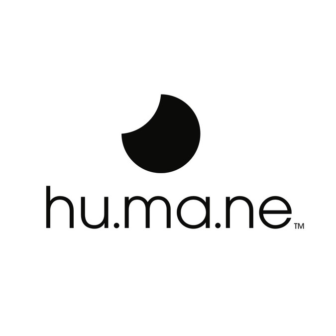
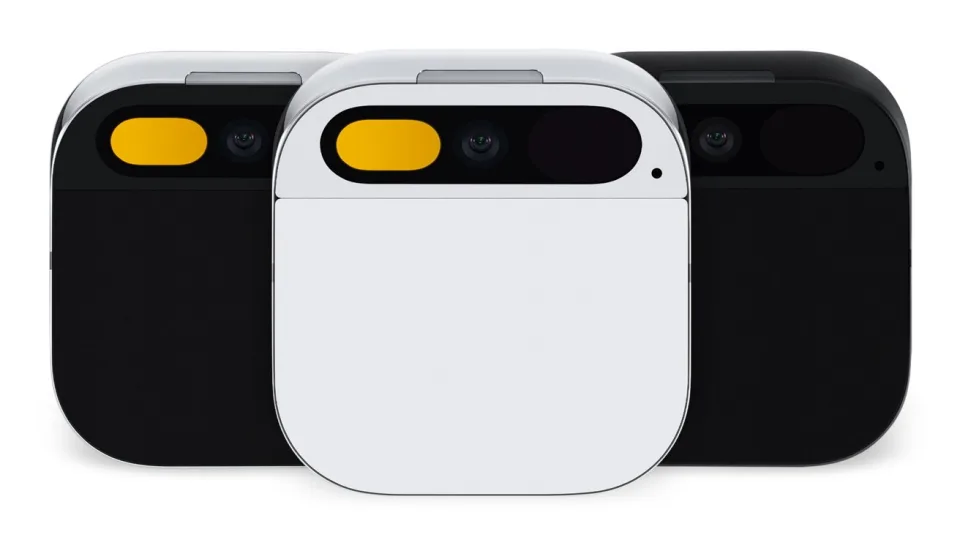

# Humane, Inc.

## Overview
>***"We believe in building innovative technology that feels familiar, natural, and human.
Technology that improves the human experience and is born from good intentions.
Products that put us back in touch with ourselves, each other, and the world around us.
Experiences that are built on trust with interactions that feel magical, and bring joy.
Humane was founded on the principle that we all deserve more from technology." - Humane Mission Statement***

Humane was incorporated in 2018 by Imran Chaudri and Bethany Bongiorno, both of whom used to work for Apple on both iPhone and iPad. They claim that the idea for the company came out through motivation to reimagine the role technology might play in the next role of innovation. Their product offering, the Humane AI Pin, is a wearable that gives the user access to their own personal AI, without the use of traditional screens or apps. Instead of a screen, the pin utilizes a laser that projects an interface onto the users palm, in which can be interacted with via hand gestures. Humane is founded by investors such as Kindred Ventures, Sam Altman of OpenAI, and Salesforce. As of this writing, they have received over $242 million over 4 investment rounds. 

## Business Activities

 The Humane AI Pin does not use or apps or screens (in the traditional sense), but instead uses tap gestures and voice interactions to interact with a personal AI that utilizes OpenAI's ChatGPT. One of the huge advantages Humane has over their competitors is their overall talent, as both Chaudri and Bongiorno have extensive backgrounds in technology, as they were both formerly with Apple and were integral to some of Apple's most popular products such as the iPhone and and iPad. In addition, their partnerships with OpenAI and Microsoft give them access to vast technological and financial resources as long as they continue to have a stake in Humane going forward. When compared to their direct competitor, the R1 by Rabbit Inc, their device lacks the ability to integrate with apps and does not have a translator (yet).

 Chaudri states that the current state of technology acts as a barrier between humans and the world, which is why he believes in the no screens and that the "future of technology will not be worn on the face" (The Disappearing Computer). The technology the AI pin offers is there when you need it and gone when you have finished your task so as not to interfere with our connection to the world around us. This point was illustrated when Chaudri revealed the laser projection screen during a TED Talks event, where he used his palm as the backdrop for the laser projection to show that his wife was calling him. 

 During the official reveal of the AI Pin, Chaudri further showcased that the laser projection was capable of showing the weather forecast and a basic music interface in which he illustrated the different ways you can play music by using simple hand gestures.
 
 
 
 The design of the pin looks very polished and *Apple-esqe*, which comes at no surprise considering both of the founders' background. Humane's target audience includes middle/upper class customers, tech enthusiasts, and early adopters. The Humane AI Pin, starts at $699 and requires a $24 monthly subscription. Per **Yahoo Finance**, "the Wearable AI Market size value in 2023 was $22.3 billion, with the projection by 2030 to reach $129 billion." 

Specifications of the pin include an Octa-core Qualcomm Snapdragon processor with 4 GB of RAM and 32GB of storage. The touchpad recognizes various gestures and taps, an AI mic, and LED lights to indicate various alerts. Some of the more notable tech that Humane is leveraging in their wearable is the aforementioned LLM with OpenAI, though the company has been mum up to this point to which iteration of the GPT they are using. 

The laser projection system they are using is similar to a laser scanner that you would see at a retail store, but this one is capable of beaming an interface onto your hand at a 720p Resolution. 

The Humane AI pin also boasts a 13MP camera that can not only take pictures and videos, but can also recognize objects and provide information on what it sees. The video resolution is 30fps with 1080p coming soon, according to Humane's website.

## Landscape
The landscape in which Humane operates has seen massive growth not only in terms of how the technology has evolved, but also those companies who seek to capitalize on how AI is going to impact **Technology and Daily Life** in our world going forward. Some of the major developments in the last 5-10 years are as follows: 
- In 2012, AlexNet achieves a breakthrough in image recognition.
- In the 2010s, companies Google and Amazon introduce Google Cloud and Amazon Web Services, respectively, which provide the resources necessary for training and and deploying AI models to scale.
- 2010s there is significant progress in natural language processing, or NLPs that lead to the development of chatbots and virtual assistants like Alexa.
- 2020s there is an increase in public awareness of AI lead to conversations about responsible design and deployment of AI.
- In 2022, Large language models emerge that are able to generate human-like interactions, answer questions and translate.

Big tech companies such as Meta, Apple and Microsoft are all notable players in this emerging field, as well as startup Rabbit Inc., which is a direct competitor to Humane's AI Pin.

## Results

To date, Humane has been very secretive about preorder numbers, which went live last November. This makes it very difficult to determine the success or performance of the company without knowing the anything about preorder numbers. The first orders were expected to ship sometime in March, but more likely April after a delay in shipping. Without feedback from real world users, it becomes difficult to apply the typical metrics such as conversion rates, sign ups, activations, user engagement, etc. Most of the information we have to go off of at the moment are various opinions and anecdotes of tech journalists and information straight from Humane. Most recently it was announced in January, that Humane laid off ten employees in a move that was described as a cost cutting measure.

By contrast, Rabbit sold 50,000 units of the R1 in the first five days of their preorders.

## Recommendations

I think it is a great idea that Humane wants to liberate us from screens and get us more attuned to the world around us, but my question is, "Is it too late?" What I mean by that is that so many consumers are addicted to their phones and glued to their screen. It has become part of our daily routines, for better or for worse and I am not certain it will be easy to break these habits that have been part of our lives for so long. We are heavily conditioned to use screens for work, general fact finding, and entertainment. It will take more than having a personal AI assistant that we engage with primarily with our voices to promote such a radical shift in the way we currently use our technology. I also express deep skepticism about their "no apps" stance and it potentially hindering what this device can do if consumers are able to customize their device with apps they use daily. The required monthly subscription service to use the device does not make transitioning to this device any easier. These are things that I would reconsider.

To the best of my understanding in using the AI Pin, you first pose a question to the AI, and then depending on the nature of your question, it routes your query to one of several possible AI's that will handle the task. Well, without apps that means that you are stuck with the onboard AI's that are built in. What if the none of the onboard AI's are well suited to handle your query/task? Are we expected to wait for updates to the device before we can get a capable AI that can then perform the task? How fast do updates come? By contrast, if our phone does not have the necessary application to do what we want, we at least have the option to go the app store and find the right application.

I like the concept of the laser projection and how it acts as a "screen" of sorts, but from what I have seen is that it is this monochromatic blue/teal color and while the specifications on their website states  that it displays at a 720p resolution, the videos in which this is showcased, it does not look good in my opinion. Our phones nowadays are capable of 4k resolutions with vibrant color displays. There are too many questions about how this works that has yet to be answered, for example:

- How does it look outside on a sunny day?
- How well does it track your hand? 
- Does your hand have to stay still while in use?
- Will future updates allow for customization?

During the initial reveal of the pin there were two errors that the AI made that social media was quick to criticize: 

1. The AI gave bad information back about where  and when to view the next eclipse and 
2. The AI gave the wrong protein count when Chaudri was showing off the device's ability to analyze food and provide nutritional feedback.

 I believe that if the device had an acceptable graphical interface, one could easily determine or "fact check" information. As of right now if you ask the AI Pin a question, you have to take the AI at its word that the provided information is accurate. If we think about what we do now with our devices, when we type a question in a search engine, we get our search results back, we can check our information against multiple sources, if we choose. This is possible because we can ***see*** the information being provided to us in real time. 

I agree Humane's mission statement and what they want to accomplish, but I do not think this device is the one to replace our smartphones. It is, however, a **step** in the right direction. Is it a small step or a large one? That remains to be seen. It is hard to fully embrace the deployment of this new tech when it does not really give us a reason to ditch what we have now. I do not think that our current technology is capable of allowing us to give up on our smartphones. I do think that there are several companies right now that are in various stages of development that may one day converge into that technology, and I would like to explain and give my opinion.

Rabbit's R1 device utilizes that they call a Large Action Model, or LAM that learns the interfaces that apps use whether it is iOS or Android, and triggers actions to complete user requests. The example provided by Jesse Lyu provides during his keynote was that if you ask ChatGpt to book an airline flight, that it can only give you options, you still have to trigger the action of booking said flight as the user. Contrast that with his LAM, you can use the R1 to complete the task from beginning to end. They seem to be taking the opposite approach to Humane whereas they are using their tech in conjunction with the apps we use daily. There is also the option to teach the R1 new tasks including using Generative AI.

Apple's Vision Pro is using augmented reality to broadcast layered screens into your field of vision. By using eye tracking technology, you can perform many actions by simply looking at a window, (the same that you would see on your mac or PC), and manipulate it with hand gestures. While very impressive, you still have to wear this device on your face, it has weight, limited app availability and the noise and motion blur that is present in the "pass-through" can be distracting. 

Meta's Quest 3 Headset can achieve a lot of what the Vision Pro does, at a fraction of the cost, but it is not quite as polished as the Vision Pro.

Mojo Vision is working on a contact lense that utilizes micro LED technology that is supposed to provide a GUI in your contact lens. I look forward to updates from this company in the future.

In my opinion, I think the device to replace our smartphones would utilize characteristics from both Apple and Rabbits' devices offer. Humane would stand to benefit from these integrations in the following ways:

1. You can still utilize a GUI when you need it and it goes away when you don't, thus still following your motto of not having screens become a barrier between you and the world. This can be achieved by using the concept of using lenses like the Vision Pro to use AR to project screens into your environment.
2. You can still use and have the ability to use apps, so you dont completely take away what consumers already use and risk putting a huge limitation on your offering. 
3. Use of hand and eye tracking to interact with onboard AI and other software, similar to what the Vision Pro uses in their headsets.

This proposed device would of course look dramatically different than the wearable Humane is offering. The only form factor I think this would take would be that of glasses. By using this form factor, you're not inventing some new wearable that you have to justify putting on, but rather something so many of us use already. This would give consumers a new way to interact with the world with new technology that feels familiar and in an innovative way that enhances their experiences with the world.

## Sources and Addendum

[Humane website - press release, device specifications](https://humane.com/)

[Humane Wants Its New AI Pin to Liberate You From Your Phone Screen](https://time.com/6333416/humane-ai-pin-launch/)

[The Humane AI Pin is a bizzarre cross between Google Glass and a pager](https://arstechnica.com/gadgets/2023/11/humane-ai-pin-a-700-voice-command-box-definitely-wont-replace-your-phone/)

[Explainer: Humane AI Pin Gear](https://stratheia.com/explainer-humane-ai-pin-gear/#:~:text=Despite%20its%20privacy%20assurances%2C%20the,RAM%2C%20and%2032GB%20of%20storage.)

[Rabbit - Keynote](https://www.rabbit.tech/keynote)

[The Disappearing Computer - and a World Where You Can Take AI Everywhere](https://www.youtube.com/watch?v=gMsQO5u7-NQ)

[WVFRM Podcast: Is Humane's AI Pin the Future or a Flop?](https://www.youtube.com/watch?v=2as2Ptjf44E&t=1234s)

[Humane, a stealthy hardware and software startup co-founded by an ex-Apple designer and engineer, raises $100M](https://techcrunch.com/2021/09/01/humane-a-stealthy-hardware-and-software-startup-co-founded-by-an-ex-apple-designer-and-engineer-raises-100m/?guccounter=1)

[When Residual Learning Meets Dense Aggregation: Rethinking the Aggregation of Deep Neural Networks](https://arxiv.org/pdf/2004.08796)

[The History of Chatbots - From ELIZA to ChatGPT](https://onlim.com/en/the-history-of-chatbots/)

[Artificial Intelligence
From recommender algorithms to chatbots to self-driving cars, AI is changing our lives. As the impact of this technology grows, so will the risks.](https://futureoflife.org/cause-area/artificial-intelligence/)

[Wearable AI Market projected to reach USD 129.0 Billion by 2030, growing at a CAGR of 28.5% during the forecast period of 2023-2030 - pronounced by MarketDigits in its recent study](https://finance.yahoo.com/news/wearable-ai-market-projected-reach-110000288.html)

[Humane’s AI Pin: all the news about the new AI-powered wearable](https://www.theverge.com/2023/11/9/23954497/humane-ai-pin-wearable-news-announcements)

[Mojo Vision](https://www.mojo.vision/)

